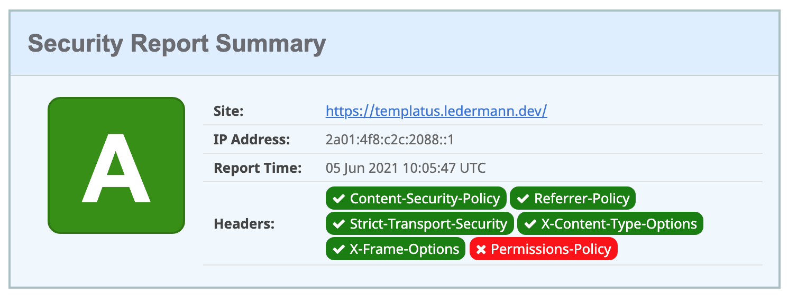

[](https://github.com/ledermann/templatus-stimulus/actions)
[](https://dashboard.cypress.io/projects/5d6bqs/runs)
[](https://deepsource.io/gh/ledermann/templatus-stimulus/?ref=repository-badge)

# Templatus-Stimulus

Templatus-Stimulus is an opinionated template to build web applications with Ruby on Rails and Vue.js 3. It simplifies the process of setting up a new application while following best practices.

Live demo available at https://templatus-stimulus.ledermann.dev

## Features / Technology stack

### Backend

- [Ruby](https://www.ruby-lang.org/de/) 3
- [Ruby on Rails](https://rubyonrails.org/) 6.1
- [ActionCable](https://guides.rubyonrails.org/action_cable_overview.html) for WebSocket communication
- [PostgreSQL](https://www.postgresql.org/) for using as SQL database
- [Sidekiq](https://sidekiq.org/) for background processing
- [Redis](https://redis.io/) for Caching, ActionCable, and Sidekiq

### Frontend

- [Webpacker](https://github.com/rails/webpacker) 6 (still not released, but this allows using Webpack v5 and webpack-dev-server v4)
- [Vue 3](https://v3.vuejs.org/) as frontend framework
- [Vue Router 4](https://next.router.vuejs.org/) for frontend routing
- [Pinia](https://pinia.esm.dev/) for frontend state management
- [Tailwind CSS 3](https://tailwindcss.com/) to not have to write CSS at all
- [HeadlessUI](https://headlessui.dev/) unstyled, fully accessible UI components designed to integrate with Tailwind CSS
- [Heroicons](https://heroicons.com/) for SVG icons as Vue components
- [Rails Request.JS](https://github.com/rails/request.js) for AJAX requests with default headers

### Development

- [Puma-dev](https://github.com/puma/puma-dev) for using .test-domain and HTTPS in development
- [Foreman](https://github.com/ddollar/foreman) for starting up the application locally
- [dotenv](https://github.com/bkeepers/dotenv) to load environment variables from .env into ENV
- [TypeScript](https://www.typescriptlang.org/) for writing strongly-typed JavaScript
- [Prettier](https://prettier.io/) for auto-formatting JavaScript and Ruby code in Visual Studio Code

### Linting and testing

- [RuboCop](https://rubocop.org/) for Ruby static code analysis
- [ESLint](https://eslint.org/) for JavaScript static code analysis
- [RSpec](https://rspec.info/) for Ruby testing
- [Jest](https://jestjs.io/) for JavaScript unit testing
- [Cypress](https://www.cypress.io/) for E2E testing

### Deployment

- [Docker](https://www.docker.com/) for production deployment, NOT for development
- [DockerRailsBase](https://github.com/ledermann/docker-rails-base) for fast building an optimized Docker image based on Alpine Linux
- [GitHub Actions](https://docs.github.com/en/actions) for testing, linting, and building Docker image
- [Dependabot](https://docs.github.com/en/code-security/supply-chain-security/keeping-your-dependencies-updated-automatically/about-dependabot-version-updates) configuration for updating dependencies (with auto-merge)
- Ready for serving assets via CDN like CloudFront
- [Honeybadger](https://www.honeybadger.io/) for error tracking in Ruby and JavaScript

### Production

- [Lograge](https://github.com/roidrage/lograge) for single-line logging
- Gzip and Brotli compression of all dynamic responses (HTML, JSON) using [Rack::Deflater](https://github.com/rack/rack/blob/master/lib/rack/deflater.rb) and [Rack::Brotli](https://github.com/marcotc/rack-brotli)
- JavaScript Code splitting (separate vendor code from application code)
- Fine-tuned Content Security Policy (CSP)
- Ready for PWA (manifest, service-worker)

## Metrics

This template is developed with optimized performance and security in mind. The following benchmarks are
performed against the demo installation on production. It uses an inexpensive virtual server on the [Hetzner Cloud](https://www.hetzner.com/de/cloud) behind a [Traefik](https://traefik.io/traefik/) setup.

### Lighthouse site performance

100% in all categories.


### Secure headers

[](https://securityheaders.com/?q=templatus-stimulus.ledermann.dev&followRedirects=on)

What's the red _Permissions-Policy_ badge? This seems to be fixed with one of the next Rails update:
https://github.com/rails/rails/pull/41994

### Mozilla Observatory

[](https://observatory.mozilla.org/analyze/templatus-stimulus.ledermann.dev)

Why is there a failing test? It's about missing [Subresource Integrity](https://infosec.mozilla.org/guidelines/web_security#subresource-integrity), which is currently not supported by Webpacker. There is a [stale issue](https://github.com/rails/webpacker/issues/323) about it, I don't expect a fix shortly.

### WebPageTest

[](https://webpagetest.org/result/211031_BiDcEW_766a9f225f0ae81c9bc42bdff4f726c3/)

### GTmetrix

[](https://gtmetrix.com/reports/templatus-stimulus.ledermann.dev/0tAiViV6/)

### Check-your-website

[](https://check-your-website.server-daten.de/?q=templatus-stimulus.ledermann.dev)

### JavaScript size

150 KB of compiled JavaScript (minified, uncompressed). The largest parts are:

- Vue.js + Vue Router (77 KB)
- Headless UI (10 KB)
- Honeybadger (22 KB)
- Pinia (6 KB)
- ActionCable (10 KB)

```
RAILS_ENV=production SECRET_KEY_BASE=temp bin/rails webpacker:clobber webpacker:compile
Compiling...
Compiled all packs in /Users/ledermann/Projects/templatus-stimulus/public/packs
assets by path static/ 4.45 KiB
  assets by path static/*.svg 2.33 KiB 2 assets
  assets by path static/*.gz 1.13 KiB
    asset static/rails-bcb6d75d927347158af5.svg.gz 902 bytes [emitted] [immutable] [compressed]
    asset static/vue-f04dfe30a8ad8eb5c4e0.svg.gz 254 bytes [emitted] [immutable] [compressed]
  assets by path static/*.br 1020 bytes
    asset static/rails-bcb6d75d927347158af5.svg.br 796 bytes [emitted] [immutable] [compressed]
    asset static/vue-f04dfe30a8ad8eb5c4e0.svg.br 224 bytes [emitted] [immutable] [compressed]
assets by path js/*.js 150 KiB
  asset js/395-b227a3cb720709516a53.js 133 KiB [emitted] [immutable] [minimized] (id hint: vendors) 4 related assets
  asset js/application-152600e4c361ce30cc75.js 15.8 KiB [emitted] [immutable] [minimized] (name: application) 3 related assets
  asset js/runtime-218550da3001279e7e74.js 1.46 KiB [emitted] [immutable] [minimized] (name: runtime) 3 related assets
asset css/application-1857ea4a.css 17 KiB [emitted] [immutable] [minimized] (name: application) 3 related assets
asset manifest.json 2.99 KiB [emitted] 2 related assets
Entrypoint application 167 KiB (229 KiB) = js/runtime-218550da3001279e7e74.js 1.46 KiB js/395-b227a3cb720709516a53.js 133 KiB css/application-1857ea4a.css 17 KiB js/application-152600e4c361ce30cc75.js 15.8 KiB 6 auxiliary assets
orphan modules 391 KiB (javascript) 997 bytes (runtime) [orphan] 333 modules
runtime modules 3.47 KiB 7 modules
built modules 788 KiB (javascript) 2.33 KiB (asset) 25.1 KiB (css/mini-extract) [built]
  modules by path ./node_modules/ 759 KiB
    modules by path ./node_modules/@vue/ 424 KiB 4 modules
    modules by path ./node_modules/@honeybadger-io/ 62.6 KiB 2 modules
    modules by path ./node_modules/@rails/ 26.1 KiB
      ./node_modules/@rails/actioncable/app/assets/javascripts/action_cable.js 18.6 KiB [built] [code generated]
      ./node_modules/@rails/request.js/src/verbs.js + 4 modules 7.52 KiB [built] [code generated]
  modules by path ./app/javascript/ 29.4 KiB (javascript) 2.33 KiB (asset) 25.1 KiB (css/mini-extract)
    modules by path ./app/javascript/images/ 274 bytes (javascript) 2.33 KiB (asset) 3 modules
    ./app/javascript/application.ts + 31 modules 29.1 KiB [built] [code generated]
    css ./node_modules/css-loader/dist/cjs.js??clonedRuleSet-3.use[1]!./node_modules/postcss-loader/dist/cjs.js??clonedRuleSet-3.use[2]!./app/javascript/stylesheets/application.css 25.1 KiB [built] [code generated]
webpack 5.65.0 compiled successfully in 6455 ms
```

### Network transfer

Small footprint: The demo application transfers only **65 KB** of data on the first visit.


### Docker build time

With multi-stage building and using [DockerRailsBase](https://github.com/ledermann/docker-rails-base) the build of the Docker image takes very little time. Currently, the build job requires about 1,5 minutes on GitHub Actions (see https://github.com/ledermann/templatus-stimulus/actions)

### Docker image size

The Docker image is based on Alpine Linux and is optimized for minimal size (currently **115 MB** uncompressed disk size). It includes just the bare minimum - no build tools like Node.js, no JS sources (just the compiled assets), no tests.

```
$ container-diff analyze ghcr.io/ledermann/templatus-stimulus -n

-----Size-----

Analysis for ghcr.io/ledermann/templatus-stimulus:
IMAGE                              DIGEST         SIZE
ghcr.io/ledermann/templatus-stimulus        sha256:...   114.9M
```

## Getting

### Development installation

1. Clone the repo locally:

```bash
git clone git@github.com:ledermann/templatus-stimulus.git
cd templatus-stimulus
```

2. Install PostgreSQL, Redis, and puma-dev (if not already present). On a Mac with HomeBrew, run this to install from the `Brewfile`:

```bash
brew bundle
```

3. Install and set up [puma-dev](https://github.com/puma/puma-dev) to use HTTPS for both the application and `webpack-dev-server`. Do this on macOS:

```bash
sudo puma-dev -setup
puma-dev -install
puma-dev link

# Use https in development and load webpack from subdomain
# https://github.com/puma/puma-dev#webpack-dev-server
echo 3035 > ~/.puma-dev/webpack.templatus-stimulus
```

4. Setup the application to install gems and NPM packages and create the database:

```bash
bin/setup
```

5. Start the application (and webpack-dev-server) locally:

```bash
bin/dev
```

Then open https://templatus-stimulus.test in your browser.

### Running linters

RuboCop:

```
bin/rubocop
```

ESLint:

```
bin/yarn lint
```

TypeScript compiler:

```
bin/yarn tsc
```

### Running tests locally

Ruby tests:

```
bin/rspec
open coverage/index.html
```

JavaScript unit tests:

```
bin/yarn test
```

E2E tests with Cypress:

```
bin/cypress open
```

This opens Cypress and starts Rails in `development` environment, but with `CYPRESS=true`, so the `test` database is used. This allows code editing without class reloading and recompiling assets.

To run Cypress in headless mode:

```
bin/cypress run
```

### Test deployment locally

```
docker network create public
docker-compose up
```
