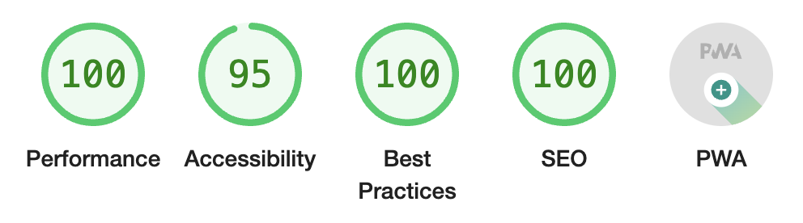
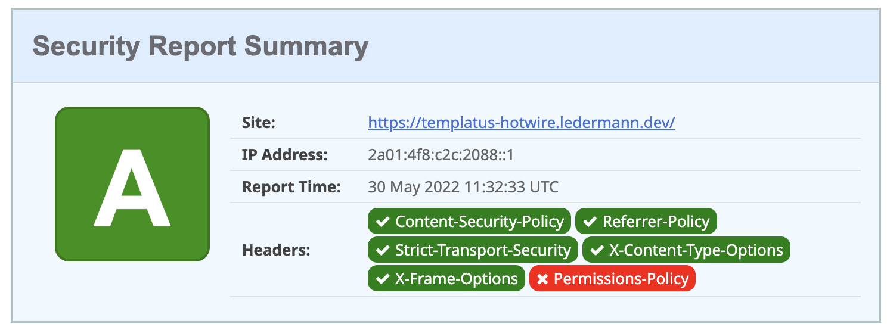
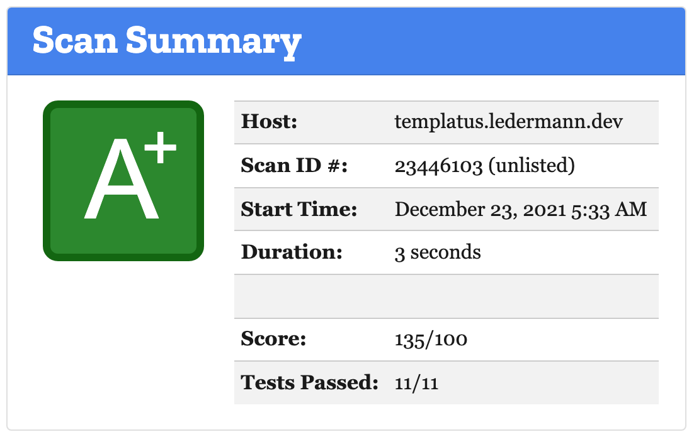
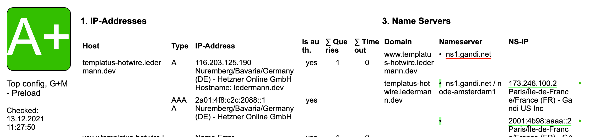
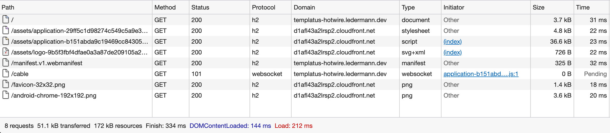

[](https://github.com/templatus/templatus-hotwire/actions)

# Templatus (Hotwire edition)

Templatus is an opinionated template to build web applications with Ruby on Rails and Hotwire. It simplifies the process of setting up a new application while following best practices.

Live demo available at https://templatus-hotwire.ledermann.dev

## Similar projects

There are two sister repositories:

- For using Vue.js instead of Hotwire: https://github.com/templatus/templatus-vue/
- For using Inertia and Svelte.js instead of Hotwire: https://github.com/templatus/templatus-inertia/

## Features / Technology stack

### Backend

- [Ruby](https://www.ruby-lang.org/de/) 4.0
- [Ruby on Rails](https://rubyonrails.org/) 8.1
- [ActionCable](https://guides.rubyonrails.org/action_cable_overview.html) for WebSocket communication
- [PostgreSQL](https://www.postgresql.org/) for using as SQL database
- [Sidekiq](https://sidekiq.org/) for background processing
- [Pagy](https://ddnexus.github.io/pagy/) with keyset (cursor) pagination for endless scrolling with constant query time
- [Redis](https://redis.io/) for Caching, ActionCable, and Sidekiq, each on its own database

### Frontend

- [Hotwire](https://hotwired.dev/) for building the frontend without using much JavaScript by sending HTML instead of JSON over the wire
- [TypeScript](https://www.typescriptlang.org/) for static type checking in Stimulus controllers and other script code
- [ViewComponent](https://viewcomponent.org/) for building reusable, testable & encapsulated view components
- [Tailwind CSS 4](https://tailwindcss.com/) to not have to write CSS at all
- [daisyUI 5](https://daisyui.com/) for semantic component classes and a themeable color system (custom light and dark theme, switchable between light/dark/system)
- [Lucide](https://lucide.dev/) icons via [Iconify](https://iconify.design/) for Tailwind, rendered as CSS masks (no runtime JS, CSS is emitted only for the icons actually used)
- [Vite](https://vitejs.dev/) for bundling JavaScript and CSS with Hot Module Replacement (HMR) in development
- [Bun](https://bun.sh/) as package manager for JavaScript dependencies

### Development

- [Caddy](https://caddyserver.com/) for automatic HTTPS on `.localhost` domains in development
- [Overmind](https://github.com/DarthSim/overmind) for starting up the application locally (Procfile handling like Foreman)
- [dotenv](https://github.com/bkeepers/dotenv) to load environment variables from .env into ENV
- [Prettier](https://prettier.io/) for auto-formatting JavaScript, TypeScript and CSS in Visual Studio Code
- [Herb](https://herb-tools.dev/) for linting and formatting ERB templates, including Tailwind class sorting
- [Ruby LSP](https://github.com/Shopify/ruby-lsp) with RuboCop for auto-formatting Ruby code in Visual Studio Code
- [Lookbook](https://github.com/allmarkedup/lookbook) as development UI for ViewComponent
- [annotaterb](https://github.com/drwl/annotaterb) for annotating models and routes
- Live reloading

### Linting and testing

- [RuboCop](https://rubocop.org/) for Ruby static code analysis
- [ESLint](https://eslint.org/) for JavaScript static code analysis
- [ShellCheck](https://www.shellcheck.net/) for linting shell scripts
- [Brakeman](https://brakemanscanner.org/) for static security analysis of Rails code
- [bundler-audit](https://github.com/rubysec/bundler-audit) and `bun audit` for checking dependencies against known vulnerabilities
- [size-limit](https://github.com/ai/size-limit) to keep the compiled JavaScript below a fixed budget
- [RSpec](https://rspec.info/) for Ruby testing
- [Factory Bot](https://github.com/thoughtbot/factory_bot) for setting up Ruby objects as test data
- [Capybara](https://github.com/teamcapybara/capybara) with [Playwright](https://playwright.dev/docs/intro) for system tests

### Deployment

- [Docker](https://www.docker.com/) for production deployment, NOT for development
- [DockerRailsBase](https://github.com/ledermann/docker-rails-base) for fast building an optimized Docker image based on Alpine Linux
- [GitHub Actions](https://docs.github.com/en/actions) for testing, linting, and building Docker image
- [Dependabot](https://docs.github.com/en/code-security/supply-chain-security/keeping-your-dependencies-updated-automatically/about-dependabot-version-updates) configuration for updating dependencies (with auto-merge), grouped per toolchain and with a cooldown that matches Bun's `minimumReleaseAge`, so freshly published (and possibly malicious) versions are never installed right away
- Ready for serving assets via CDN like CloudFront
- [Honeybadger](https://www.honeybadger.io/) for error tracking in Ruby and JavaScript
- [RorVsWild](https://www.rorvswild.com/) for performance monitoring
- [Plausible](https://plausible.io/) for privacy friendly analytics
- [Lockup](https://lockup.interdiscipline.com/) to place a staging server behind a basic codeword

### Production

- [Lograge](https://github.com/roidrage/lograge) for single-line logging
- Gzip and Brotli compression of dynamic responses (HTML, JSON) using [Rack::Deflater](https://github.com/rack/rack/blob/master/lib/rack/deflater.rb), [Rack::Brotli](https://github.com/marcotc/rack-brotli)
- Fine-tuned Content Security Policy (CSP)
- Ready for PWA (manifest, service-worker)

## Metrics

This template is developed with optimized performance and security in mind. The following benchmarks are
performed against the demo installation on production. It uses an inexpensive virtual server on the [Hetzner Cloud](https://www.hetzner.com/de/cloud) behind a [Traefik](https://traefik.io/traefik/) setup.

### Lighthouse site performance

100% in all categories.



### Security headers

[](https://securityheaders.com/?q=templatus-hotwire.ledermann.dev&followRedirects=on)

### MDN HTTP Observatory

[](https://developer.mozilla.org/en-US/observatory/analyze?host=templatus-hotwire.ledermann.dev)

### Check-your-website

[](https://check-your-website.server-daten.de/?q=templatus-hotwire.ledermann.dev)

### JavaScript size

215 KB of compiled JavaScript (minified, uncompressed). The largest parts are:

- Turbo with ActionCable (72 KB)
- Stimulus (32 KB)
- Honeybadger (25 KB)

There is no JavaScript for icons at all: they are CSS masks generated at build
time, and only for the icons actually used.

```
$ SECRET_KEY_BASE_DUMMY=1 RAILS_ENV=production bin/rails assets:precompile
bun install v1.3.14 (0d9b296a)

Checked 222 installs across 266 packages (no changes) [14.00ms]
vite v8.1.5 building client environment for production...
/*! 🌼 daisyUI 5.6.18 */
✓ 47 modules transformed.
computing gzip size...
public/vite/manifest.json.br                          0.26 kB
public/vite/assets/logo-DdqaqAN0.svg.br               0.26 kB
public/vite/manifest.json.gz                          0.30 kB
public/vite/assets/logo-DdqaqAN0.svg.gz               0.30 kB
public/vite/assets/rolldown-runtime-QTnfLwEv.js.br    0.37 kB
public/vite/assets/rolldown-runtime-QTnfLwEv.js.gz    0.42 kB
public/vite/assets/logo-DdqaqAN0.svg                  0.49 kB │ gzip:  0.30 kB
public/vite/manifest.json                             1.00 kB │ gzip:  0.30 kB
public/vite/assets/application-_WYGBmFW.js.br         1.61 kB
public/vite/assets/application-_WYGBmFW.js.gz         1.89 kB
public/vite/assets/application-RQtmhSlY.css.br       12.77 kB
public/vite/assets/application-RQtmhSlY.css.gz       14.85 kB
public/vite/assets/vendor-njP3BUuM.js.br             49.30 kB
public/vite/assets/vendor-njP3BUuM.js.gz             56.31 kB
public/vite/assets/application-RQtmhSlY.css          91.05 kB │ gzip: 14.98 kB
public/vite/assets/rolldown-runtime-QTnfLwEv.js       0.69 kB │ gzip:  0.42 kB
public/vite/assets/application-_WYGBmFW.js            4.80 kB │ gzip:  1.89 kB
public/vite/assets/vendor-njP3BUuM.js               209.83 kB │ gzip: 57.41 kB
```

### Network transfer

Small footprint: The demo application transfers only **62 KB** of (compressed) data on the first visit.



### Docker build time

With multi-stage building and using [DockerRailsBase](https://github.com/ledermann/docker-rails-base) the build of the Docker image takes very little time. Currently, the build job requires about 1,5 minutes on GitHub Actions (see https://github.com/templatus/templatus-hotwire/actions)

### Docker image size

The Docker image is based on Alpine Linux and is optimized for minimal size (currently **117 MB** uncompressed disk size). It includes just the bare minimum - no build tools like Node.js, no JS sources (just the compiled assets), no tests.

```
$ container-diff analyze ghcr.io/templatus/templatus-hotwire -n

-----Size-----

Analysis for ghcr.io/templatus/templatus-hotwire:
IMAGE                                      DIGEST       SIZE
ghcr.io/templatus/templatus-hotwire        sha256:... 116.7M
```

## Getting started

### Install for development

1. Clone the repo locally:

```bash
git clone git@github.com:templatus/templatus-hotwire.git
cd templatus-hotwire
```

2. Install PostgreSQL, Redis, Caddy, Overmind and ShellCheck (if not already present). On a Mac with HomeBrew, run this to install from the `Brewfile`:

```bash
brew bundle
```

3. Let Caddy install its local certificate authority, so HTTPS works without browser warnings:

```bash
caddy trust
```

4. Setup the application to install gems and JavaScript packages and create the database:

```bash
bin/setup
```

5. Start the application locally:

```bash
bin/dev
```

Then open https://templatus.localhost in your browser.

### Preview components in LookBook

```bash
bin/dev
```

Then open https://templatus.localhost/lookbook/ in your browser.

### Running linters

RuboCop:

```
bin/rubocop
```

ESLint:

```
bun run lint
```

TypeScript:

```
bun run tsc
```

ERB (linting, formatting and validation with Herb):

```
bin/herb lint
bun run erb:check   # or `bun run erb:format` to fix
bin/herb analyze .
```

Shell scripts:

```
shellcheck $(git ls-files '*.sh')
```

All of the above (plus security scans, the JavaScript size budget and the test suite), exactly as CI runs it:

```
bin/ci
```

### Running tests locally

Ruby tests:

```
bin/rspec
open coverage/index.html
```

System tests with Capybara and Playwright:

```
bin/rspec spec/system
```

### Test deployment locally

```
docker network create public
docker compose up
```
